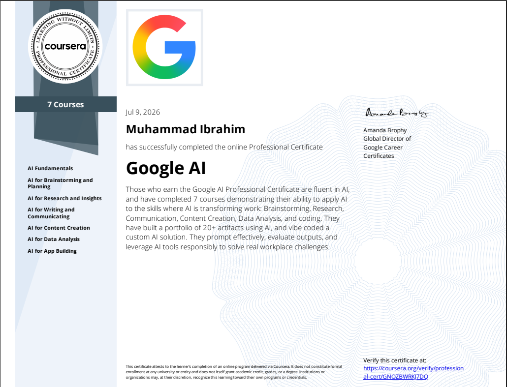

  

  

**Issued by:** Google via Coursera  
**Date:** July 9, 2026  
**Recipient:** Muhammad Ibrahim  
**Status:** Successfully Completed

---
## Overview

As a Computer Science student, I have successfully earned the **Google AI Professional Certificate**. This intensive program equipped me with practical, job-ready AI skills through **7 comprehensive courses**, enabling me to effectively apply artificial intelligence across brainstorming, research, content creation, data analysis, and application development.

I built a robust portfolio of **20+ AI artifacts** and developed a custom AI solution while mastering responsible AI practices. This certification showcases my ability to leverage modern AI tools to solve real-world problems efficiently a vital competency in today’s rapidly evolving technology landscape.

---

## Table of Contents

- [Courses Completed](#courses-completed)
- [Portfolio Projects & Artifacts](#portfolio-projects--artifacts)
  - [Brainstorm and Evaluate Ideas to Make Faster Decisions](#brainstorm-and-evaluate-ideas-to-make-faster-decisions)
  - [Build Presentation Slides with AI](#build-presentation-slides-with-ai)
  - [Build with AI Research Report](#build-with-ai-research-report)
  - [Generate Visuals with AI](#generate-visuals-with-ai)
  - [Prompt Chaining Strategies](#prompt-chaining-strategies)
  - [Prompting Tips and Tricks](#prompting-tips-and-tricks)
  - [Prompting Frameworks](#prompting-frameworks)
  - [Responsible AI Best Practices](#responsible-ai-best-practices)
  - [Vibecoding AI for App Building](#vibecoding-ai-for-app-building)
- [Skills Gained](#skills-gained)
- [Benefits in the New Tech Era](#benefits-in-the-new-tech-era)
- [Certificate Verification](#certificate-verification)

---

## Courses Completed

- AI Fundamentals
- AI for Brainstorming and Planning
- AI for Research and Insights
- AI for Writing and Communicating
- AI for Content Creation
- AI for Data Analysis
- AI for App Building

---

## Portfolio Projects & Artifacts

### Brainstorm and Evaluate Ideas to Make Faster Decisions

This project demonstrates how I used AI tools to rapidly generate, organize, and evaluate multiple ideas for complex problems. I developed structured prompting techniques to produce diverse solutions and implemented evaluation frameworks based on feasibility, impact, and innovation.

The workflow significantly reduced decision-making time while maintaining high-quality outputs. I created comparison matrices and scoring systems powered by AI to rank ideas objectively. This artifact highlights my ability to combine human creativity with AI efficiency for better outcomes in academic and professional settings.

**View more details:** [Brainstorm and evaluate ideas to make faster decisions.md](./Brainstorm%20and%20evaluate%20ideas%20to%20make%20faster%20decisions.md)

---
### Build Presentation Slides with AI

In this artifact, I leveraged AI to design and generate complete presentation decks from scratch. The process involved transforming raw ideas and research notes into visually appealing, well-structured slides with consistent design language.

I focused on audience engagement by incorporating AI-generated visuals, speaker notes, and logical flow optimization. This project showcases my capability to produce professional-quality presentations quickly using AI assistance while maintaining creative control.

**View more details:** [Build Presentation slides with AI.md](./Build%20Presentation%20slides%20with%20AI.md)

---

### Build with AI Research Report

This comprehensive research report was entirely built using AI-augmented methodologies. I conducted in-depth research, synthesized findings from multiple sources, and generated well-structured academic content with proper citations and analysis.

The project demonstrates advanced use of AI for literature review, data synthesis, and coherent report writing. I maintained critical thinking by evaluating AI outputs and refining them with domain knowledge.

**View more details:** [Build with AI Research report.md](./Build%20with%20AI%20Research%20report.md)

---

### Generate Visuals with AI

This project focuses on creating high-quality visuals, diagrams, infographics, and illustrations using AI image generation tools. I developed effective prompting strategies to produce visuals that accurately represent complex technical concepts in Computer Science.

The artifact includes before-and-after comparisons and iteration techniques to achieve desired results. All visuals were generated responsibly while respecting copyright and ethical guidelines.

**View more details:** [Generate visuals with AI.md](./Generate%20visuals%20with%20AI.md)

---

### Prompt Chaining Strategies

This artifact explores advanced **prompt chaining** techniques — breaking complex tasks into sequential, interconnected prompts. I documented various chaining patterns, tested their effectiveness on different AI models, and analyzed performance improvements.

The project includes real examples of multi-step reasoning tasks, error handling in chains, and optimization strategies. It serves as a practical guide for advanced AI users.

**View more details:** [Prompt chaining strategies.md](./Prompt%20chaining%20strategies.md)

---

--- 

  
   
  <b>Successfully completed the Google AI Professional Certificate</b> • Learning Journey • 2026

